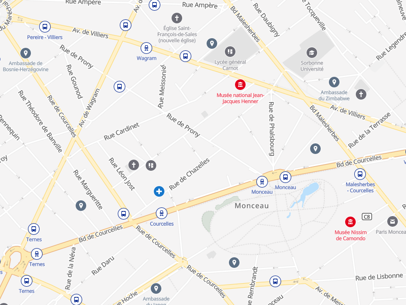
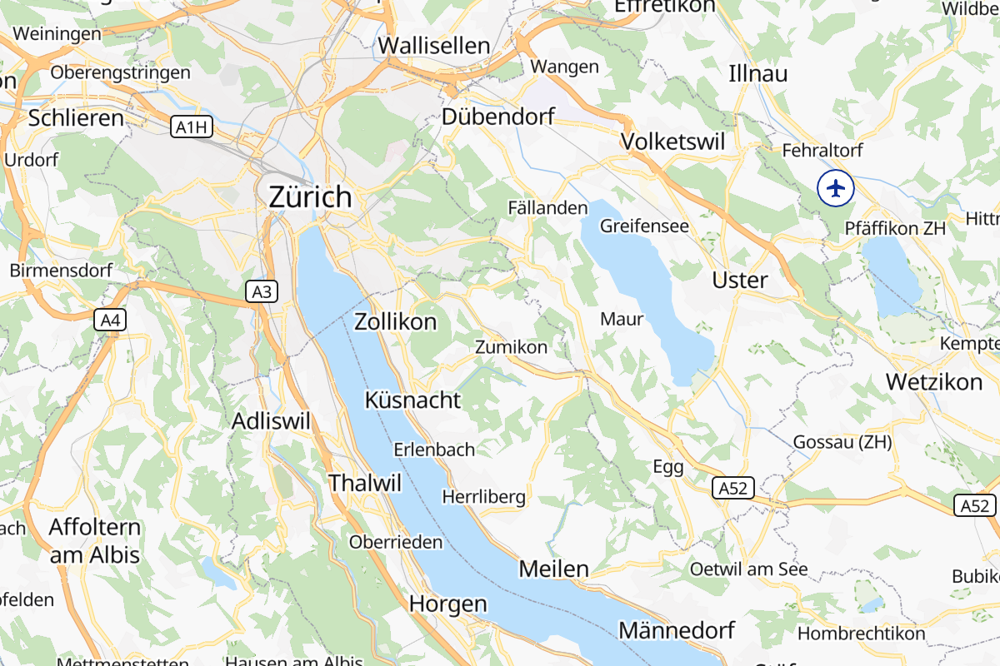
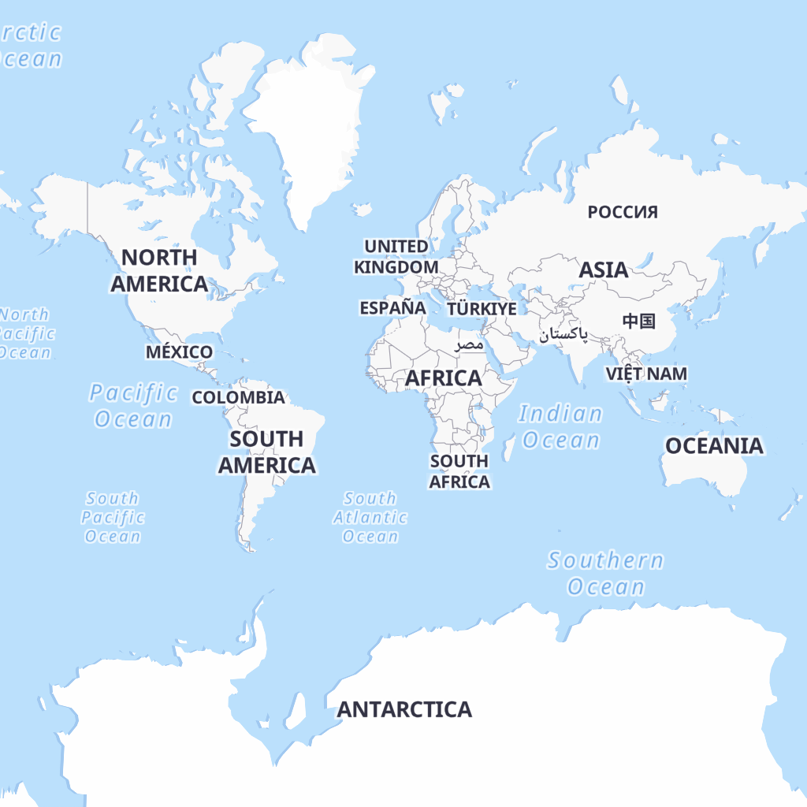
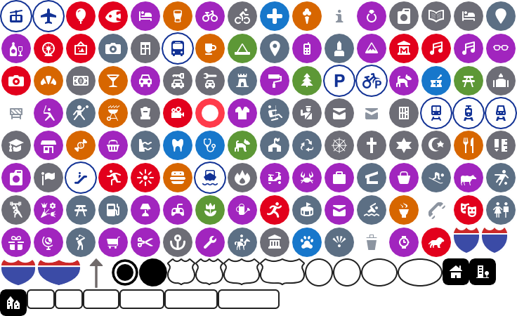

# qwant-basic-gl-style

a very cool GL style for Qwant Maps






## Use it

Create an HTML page and inclue mapboxgl js viewer. Then point to the style to this file.

```
<!DOCTYPE html>
<html>
<head>
    <meta charset='utf-8' />
    <title>Test Qwant Basic GL Style</title>
    <meta name='viewport' content='initial-scale=1,maximum-scale=1,user-scalable=no' />
    <script src='https://qwant.github.io/qwant-basic-gl-style/mapbox-gl.js'></script>
    <link href='https://qwant.github.io/qwant-basic-gl-style/mapbox-gl.css' rel='stylesheet' />
    <style>
        body { margin:0; padding:0; }
        #map { position:absolute; top:0; bottom:0; width:100%; }
    </style>
</head>
<body>
    <div id='map'></div>
    <script>
        var map = new mapboxgl.Map({
            container: 'map',
            style: 'https://qwant.github.io/qwant-basic-gl-style/style-omt.json',
            center: [2.33321, 48.86008],
            hash: true,
            zoom: 12
        });
    </script>
</body>
</html>
```

## Our sprite icons



## Contribute

[check out this repo](https://github.com/Qwant/qwant-basic-gl-style)
